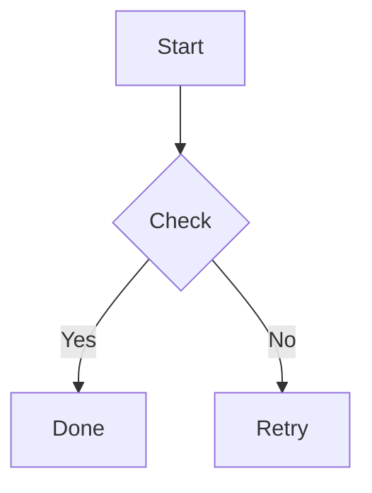

# Markdown 转 PDF

`mkpdf` 用于把单个 Markdown 文件，或者一个包含 Markdown 与静态资源的目录，转换成一个 PDF 文件。

它适合这些场景：

- 把单篇 Markdown 文档导出成可分发 PDF
- 把一整个文档目录按顺序合并成一本 PDF
- 保留常见 Markdown 样式：标题、列表、表格、引用、代码块、图片、admonition
- 支持 Mermaid 代码块渲染

## 0x01. 基本用法

### 1. 转换单个 Markdown 文件

```bash
zxtool mkpdf ./README.md
```

默认会在同目录生成 `README.pdf`。

### 2. 指定输出文件

```bash
zxtool mkpdf ./README.md -o ./dist/readme.pdf
```

### 3. 转换一个 Markdown 目录

```bash
zxtool mkpdf ./docs -o ./dist/docs.pdf
```

目录模式下默认读取目录中的 `README.md`。

### 4. 指定目录中的入口 Markdown 文件

```bash
zxtool mkpdf ./docs --file guide/index.md -o ./dist/guide.pdf
```

## 0x02. 命令参数

```bash
zxtool mkpdf <input_path> [--file <markdown_file>] [-o <output>] [--title <title>] [--browser <path>] [--mermaid-js <path>] [--no-mermaid] [--render-wait-ms <ms>]
```

| 参数 | 说明 |
| --- | --- |
| `input_path` | Markdown 文件路径，或包含 Markdown 的目录 |
| `--file` | 目录模式下指定入口 Markdown 文件，默认 `README.md` |
| `-o, --output` | 输出 PDF 文件路径，或输出目录 |
| `--title` | 覆盖默认文档标题 |
| `--browser` | 指定 Chrome / Edge / Chromium 可执行文件 |
| `--mermaid-js` | 指定 Mermaid JS 文件路径或 URL |
| `--no-mermaid` | 禁用 Mermaid 渲染 |
| `--render-wait-ms` | 浏览器打印前等待渲染的毫秒数，默认 `5000` |

## 0x03. Mermaid 支持

`mkpdf` 默认内置项目中的 Mermaid 运行时文件：

- `src/zxtoolbox/assets/mermaid/mermaid.min.js`
- `src/zxtoolbox/assets/mermaid/LICENSE`

因此默认是离线可用的，不依赖 CDN。

Markdown 中这样写即可：

````markdown

````

如果你想强制使用其他 Mermaid 版本，可以显式传：

```bash
zxtool mkpdf ./docs --mermaid-js ./vendor/mermaid.min.js
```

## 0x04. 目录输入规则

目录模式下，`mkpdf` 会：

1. 把 `input_path` 视为一个普通目录
2. 默认读取该目录下的 `README.md`
3. 如果传了 `--file`，则改为读取指定的 Markdown 文件
4. `--file` 指向的文件必须位于该目录内部

它不会读取 `mkdocs.yml`，也不会解析 `nav`。

## 0x05. 静态资源

图片和链接会按 Markdown 文件所在目录解析：

- 本地图片会自动重写为浏览器可访问的 `file://` 绝对路径
- 远程 `http/https` 链接会保留原样
- 目录中的图片、附件等静态资源不需要额外复制

## 0x06. 浏览器依赖

PDF 导出基于无头浏览器打印，因此系统中需要以下任一浏览器：

- Microsoft Edge
- Google Chrome
- Chromium

程序会自动探测常见安装位置；如果未探测到，可手动指定：

```bash
zxtool mkpdf ./docs --browser "C:\\Program Files\\Microsoft\\Edge\\Application\\msedge.exe"
```

## 0x07. 示例

### 1. 把 MkDocs 文档站导出为一本 PDF

```bash
zxtool mkpdf ./my-docs --file docs/index.md -o ./dist/my-docs.pdf --title "My Docs"
```

### 2. 使用自定义 Mermaid 文件

```bash
zxtool mkpdf ./architecture.md --mermaid-js ./vendor/mermaid.min.js
```

### 3. 渲染较慢时增加等待时间

```bash
zxtool mkpdf ./docs --render-wait-ms 12000
```

## 0x08. 注意事项

- 输入文件必须是 UTF-8 / UTF-8 BOM 编码的 Markdown
- 输出 PDF 的分页依赖浏览器排版行为
- Mermaid 图较复杂时，建议适当提高 `--render-wait-ms`
- 如果系统没有可用浏览器，命令会提示安装或通过 `--browser` 指定路径
